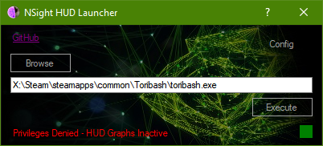

---
# Nvidia NSight HUD Launcher
---

---
### Description
- The HUD is a heads-up display which overlays directly on your application. You can use the HUD to view real-time GPU signals and performance counters, capture a frame, and scrub through its constituent draw calls.

- All actions that occur either in the HUD, or on the host inside Visual Studio — such as capturing a frame or scrubbing to a specific draw call — are automatically synchronized between the HUD and the host, and thus you can switch between using the HUD and host UI seamlessly as needed.

---